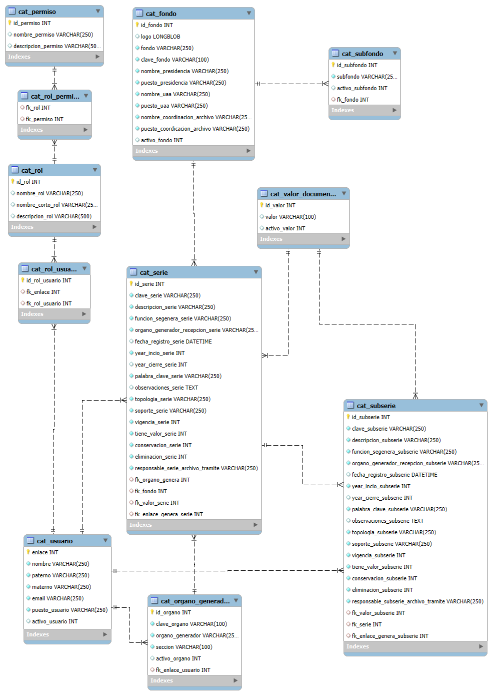

------------------------------------------------------------------------------------------------------------------------------------
# Sistema para gestion documental version 1.0
Sistema para la gestión documental del Tribunal Administrativo del Poder Judicial del Estado de Chiapas
Desarrollo: L.S.C. José Fernando Valdes Nanduca

------------------------------------------------------------------------------------------------------------------------------------
# Para la implementación del sistema se deben de seguir los siguientes pasos:
------------------------------------------------------------------------------------------------------------------------------------

# 1: Crear la base de datos
Nombre: gestion_documental
charset: utf8mb4
coleccion de datos: utf8mb4_spanish2_ci

# 2: Ejecutar los script de las tablas
    *19_09_2024_createtable.sql*

-Modelos EER

# 3

